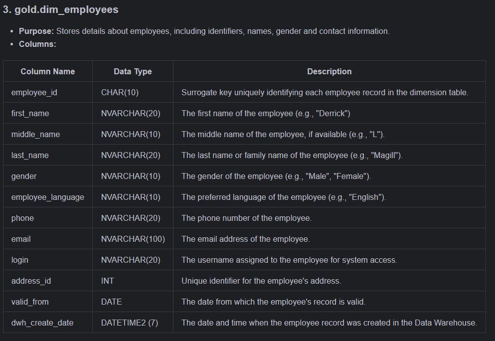

# Data Catalog for Gold Layer

## Overview
The Gold Layer is the business-level data representation, structured to support analytical and reporting use cases. It consists of **dimension tables** and **fact tables** for specific business metrics.

---

### 1. **gold.dim_products**
- **Purpose:** Stores product details, including identifiers, categories, prices, and descriptions.
- **Columns:**

| Column Name                  | Data Type     | Description                                                                                   |
|------------------------------|---------------|-----------------------------------------------------------------------------------------------|
| product_key                  | INT           | Surrogate key uniquely identifying each product record in the dimension table.                |
| product_id                   | CHAR(7)       | Unique numerical identifier assigned to each product.                                         |
| product_category_id          | CHAR(2)       | Alphanumeric identifier representing the product category.                                    |
| product_supplier_partner_id  | CHAR(10)      | The identifier of the product supplier or partner.                                            |
| product_tax_tariff_code      | INT           | The tax tariff code associated with the product.                                              |
| product_weight_kg            | DECIMAL(5,1)  | The weight of the product in kilograms.                                                       |
| product_price_$              | DECIMAL(7,2)  | The price of the product in USD.                                                              |
| product_category_created_by  | CHAR(10)      | The identifier of the person who created the product category.                                |
| product_category_created_at  | DATE          | The date and time when the product category was created in the system.                        |
| category_short_description   | NVARCHAR (50) | A brief description of the product category (e.g., 'BMX')                                     |
| product_created_by           | CHAR (10)     | The identifier of the person who created the product.                                         |
| product_created_at           | DATE          | The date and time when the product was created in the system.                                 |
| product_changed_by           | CHAR (10)     | The identifier of the person who last modified the product.                                   |
| product_changed_at           | DATE          | The date and time when the product was last modified in the system.                           |
| product_language             | NVARCHAR (20) | The language of the product information.                                                      |
| product_short_description    | NVARCHAR (50) | A short description of the product.                                                           |
| product_medium_description   | NVARCHAR (100)| A more detailed description of the product.                                                   |
| dwh_create_date              | DATETIME2 (7) | The date and time when the product record was created in the data warehouse.                  |

---

### 2. **gold.dim_business_partners**
- **Purpose:** Stores details of business partners, including identifiers, roles, and contact information.
- **Columns:**

| Column Name               | Data Type      | Description                                                                                   |
|---------------------------|----------------|-----------------------------------------------------------------------------------------------|
| business_partner_key      | INT            | Surrogate key uniquely identifying each business partner record in the dimension table.       |
| partner_id                | NVARCHAR(10)   | A unique identifier assigned to each business partner.                                        |
| partner_role              | NVARCHAR(10)   | The role of the business partner (e.g., "Customer", "Supplier").                              |
| company_name              | NVARCHAR(100)  | The name of the company associated with the business partner (e.g., "All For Bikes").         |
| legal_form                | NVARCHAR(10)   | The legal form of the business partner's company.                                             |
| email                     | NVARCHAR(100)  | The business partner's email address.                                                         |
| phone_number              | NVARCHAR(20)   | The business partner's phone number.                                                          |
| web_address               | NVARCHAR(100)  | The URL of the business partner's website.                                                    |
| partner_address_id        | INT            | Unique identifier for the business partner's address.                                         |
| addr_id                   | INT            | Identifier of the specific address for the business partner.                                  |
| addr_country              | NVARCHAR (10)  | The country where the business partner’s address is located (e.g., "US").                     |
| addr_latitude             | DECIMAL(10,6)  | Latitude of the business partner's address.                                                   |
| addr_longitude            | DECIMAL(10,6)  | Longitude of the business partner's address.                                                  |
| addr_validity_start_date  | DATE           | The start date when the address is valid.                                                     |
| currency                  | CHAR (3)       | The currency used by the business partner.                                                    |
| partner_created_by        | CHAR (10)      | The identifier of the user who created the business partner record.                           |
| partner_created_at        | DATE           | The date when the business partner record was created.                                        |
| partner_changed_by        | CHAR (10)      | The identifier of the user who last modified the business partner record.                     |
| partner_changed_at        | DATE           | The date when the business partner record was last modified.                                  |
| dwh_create_date           | DATETIME2 (7)  | The date and time when the business partner record was created in the Data Warehouse.         |

---

### 3. **gold.dim_employees**
- **Purpose:** Stores details about employees, including identifiers, names, gender and contact information.
- **Columns:**

| Column Name         | Data Type     | Description                                                                                   |
|---------------------|---------------|-----------------------------------------------------------------------------------------------|
| employee_id         | CHAR(10)      | Surrogate key uniquely identifying each employee record in the dimension table.               |
| first_name          | NVARCHAR(20)  | The first name of the employee (e.g., "Derrick")                                              |
| middle_name         | NVARCHAR(10)  | The middle name of the employee, if available (e.g., "L").                                    |
| last_name           | NVARCHAR(20)  | The last name or family name of the employee (e.g., "Magill").                                |
| gender              | NVARCHAR(10)  | The gender of the employee (e.g., "Male", "Female").                                          |
| employee_language   | NVARCHAR(10)  | The preferred language of the employee (e.g., "English").                                     |
| phone               | NVARCHAR(20)  | The phone number of the employee.                                                             |
| email               | NVARCHAR(100) | The email address of the employee.                                                            |
| login               | NVARCHAR(20)  | The username assigned to the employee for system access.                                      |
| address_id          | INT           | Unique identifier for the employee's address.                                                 |
| valid_from          | DATE          | The date from which the employee's record is valid.                                           |
| dwh_create_date     | DATETIME2 (7) | The date and time when the employee record was created in the Data Warehouse.                 |

---

### 4. **gold.dim_dates**
- **Purpose:** Stores information about dates, including identifiers, details of the day, month, quarter, and whether it's a weekend or not.
- **Columns:**

| Column Name         | Data Type     | Description                                                                                   |
|---------------------|---------------|-----------------------------------------------------------------------------------------------|
| surrogate_key       | CHAR(10)      | Surrogate key uniquely identifying each date record in the dimension table.                   |
| date                | DATE          | The actual date in a standard format (e.g., "2018-06-01").                                    |
| date_type           | NVARCHAR(10)  | The type of the date (e.g., "created_at").                                                    |
| date_id             | INT           | Unique identifier for the date in numeric format (e.g., "20180601").                          |
| year                | INT           | The year of the date (e.g., "2018").                                                          |
| quarter             | INT           | The quarter of the year (e.g., "2").                                                          |
| month               | INT           | The month number (e.g., "6").                                                                 |
| month_name          | NVARCHAR(20)  | The name of the month (e.g., "Junio").                                                        |
| week                | INT           | The week number in the year (e.g., "22").                                                     |
| day                 | INT           | The day of the month (e.g., "1").                                                             |
| day_of_week         | INT           | The numeric representation of the day of the week (e.g., "5" for Friday).                     |
| weekday_name        | NVARCHAR(10)  | The name of the day of the week (e.g., "Viernes").                                            |
| is_weekend          | BOOLEAN       | Indicator of whether the day is a weekend (0 = no, 1 = yes).                                  |

---

### 5. **gold.fact_sales**
- **Purpose:** Fact table, records sales transactions, with information about products, partners, and amounts.
- **Columns:**

| Column Name           | Data Type     | Description                                                                                   |
|-----------------------|---------------|-----------------------------------------------------------------------------------------------|
| fact_sales_id         | CHAR(10)      | Surrogate key uniquely identifying each sales transaction record in the fact table.           |
| product_key           | CHAR(10)      | The identifier of the product associated with the sale.                                       |
| business_partner_key  | CHAR(10)      | The identifier of the business partner involved in the sale.                                  |
| created_date_key      | CHAR(10)      | The date key representing when the sale was created.                                          |
| modified_date_key     | CHAR(10)      | The date key representing when the sale was modified.                                         |
| employee_key          | CHAR(10)      | The identifier of the employee who managed the sale.                                          |
| order_id              | CHAR(10)      | The unique identifier of the order associated with the sale.                                  |
| item_id               | CHAR(10)      | The identifier of the item within the order.                                                  |
| sls_order_product_id  | CHAR(7)       | Unique identifier for the product in the sales order.                                         |
| sls_order_quantity    | INT           | The quantity of products sold in the order.                                                   |
| order_partner_id      | NVARCHAR(10)  | The identifier of the partner who placed the order.                                           |
| order_org             | NVARCHAR(10)  | The identifier of the organization responsible for the sale.                                  |
| currency              | CHAR(3)       | The currency used for the transaction (e.g., "USD").                                          |
| order_gross_amount    | INT           | The gross amount of the order before deductions.                                              |
| order_net_amount      | DECIMAL (12,3)| The net amount of the order after deductions.                                                 |
| order_tax_amount      | DECIMAL (12,3)| The tax amount applied to the order.                                                          |
| lifecycle_status      | NVARCHAR(15)  | The current lifecycle status of the order (e.g., "Completed").                                |
| billing_status        | NVARCHAR(15)  | The billing status of the order (e.g., "Completed").                                          |
| delivery_status       | NVARCHAR(15)  | The delivery status of the order (e.g., "Completed").                                         |
| dwh_create_date       | DATETIME2 (7) | The date and time when the sales record was created in the Data Warehouse.                    |
